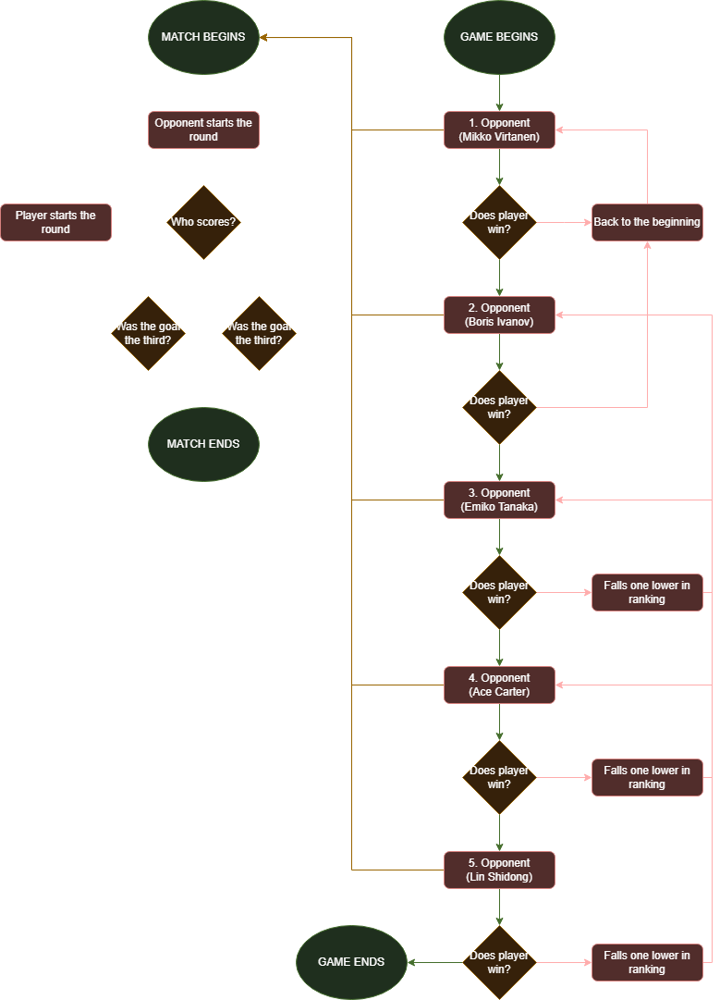
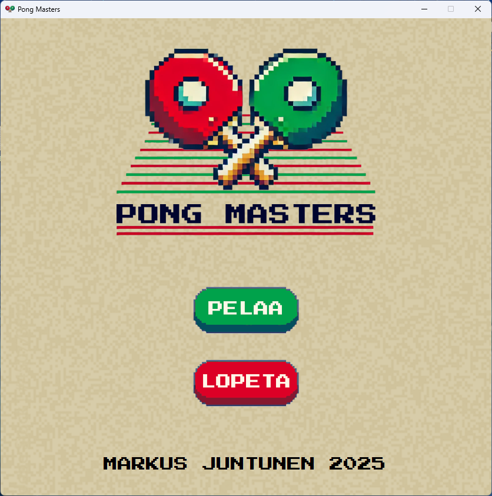
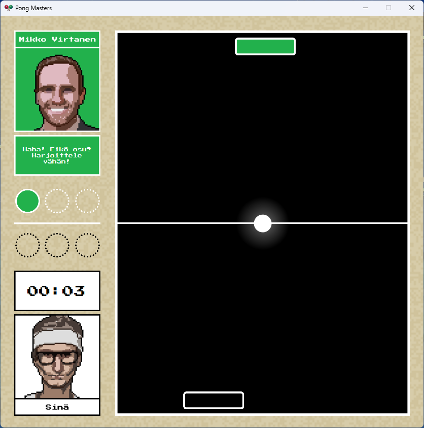
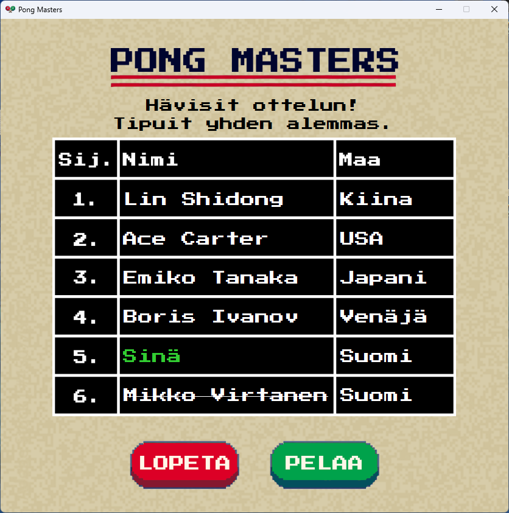

# 🏓 Pong Masters

A fast-paced single-player arcade table tennis game made in C# WinForms. The game only supports Finnish for now.

## 📚 Table of Contents
- [About the Game](#-about-the-game)
- [How It Works](#-how-it-works)
- [Game Flow](#-game-flow)
- [Screenshots](#screenshots)
- [Key Code Features](#-key-code-features)
- [Ideas for Future Development](#-ideas-for-future-development)
- [Installation](#installation)
- [License](#license)

## 🎮 About the Game

**Pong Masters** is a reaction-based game where the player battles a lineup of increasingly skilled opponents, each with unique special attacks. The objective is to win three rounds by keeping the ball in play, waiting for the opponent to make a mistake. The player moves up the scoreboard with every opponent defeated and the goal is to reach the top and win. Losing a match moves the player back one position on the scoreboard.

## 🧠 How It Works

- **Ball Physics**: The ball moves in 2D with variable speed and direction, bouncing off paddles and walls. All the movement is based on a single timer with a very small interval.
- **Opponent AI**: The opponent follows the ball’s movements. After a random number of successful hits, it intentionally starts moving away from the ball. The hit limit is randomized each round and is different for every opponent.
- **Special Moves**: Most opponents trigger special attacks at random intervals, modifying ball behavior. The number and timing of the special attacks is randomized each round.
- **Dialogue**: Each opponent has unique dialogue and reacts dynamically to the match.
- **Music**: Music is composed by me using NES VST by Matt Montag.
- **Game Progress**: A small save file (`progress.txt`) is used to track how many opponents the player has beaten.

## 📈 Game Flow



## 🖼️ Screenshots

### Main Menu


### Match Gameplay


### Scoreboard


## 🔑 Key Code Features
  
- **Main Timer**: The whole game loop is almost entirely based on this one function which runs every 16ms.
  ```csharp
  private void GameTimerEvent(object sender, EventArgs e)
  {
    // Move the ball with every tick
    ballX += ballXspeed;
    ballY += ballYspeed;

    // Ball collision with left wall
    if (ballX <= 0)
    {
      ballX = 0; // Snap to wall edge
      ballXspeed = Math.Abs(ballXspeed); // Always bounce to the right
    }

    // Ball collision with right wall
    if (ballX + ballSize >= gametable.Width)
    {
      ballX = gametable.Width - ballSize; // Snap to wall edge
      ballXspeed = -Math.Abs(ballXspeed); // Always bounce to the left
    }

    // Player scores
    if (ballY <= 0)
    {
      playerScore++;
      ResetBall();
    }

    // Opponent scores
    if (ballY + ballSize >= gametable.Height)
    {
      opponentScore++;
      ResetBall();
    }

    // Ball touches player's paddle
    if (ballRect.IntersectsWith(playerRect))
    {
      // Get a new random Y-speed
      ballYspeed = -Math.Abs(randomBall[random.Next(randomBall.Length)]);

      // Add slight randomness to X-speed
      ballXspeed = randomBall[random.Next(randomBall.Length)];
      if (random.Next(0, 2) == 0) ballXspeed = -ballXspeed;
    }

    // Ball touches opponent's paddle
    if (ballRect.IntersectsWith(opponentRect) && !opponentRecentlyHit)
    {
      opponentRecentlyHit = true; // Prevents opponent from registering multiple hits
      hitCount++;
      
      // Get a new random Y-speed
      ballYspeed = Math.Abs(randomBall[random.Next(randomBall.Length)]);

      // Add slight randomness to X-speed
      ballXspeed = randomBall[random.Next(randomBall.Length)];
      if (random.Next(0, 2) == 0) ballXspeed = -ballXspeed;

      Task.Delay(250).ContinueWith(_ => opponentRecentlyHit = false);
    }

    // Check match end condition
    if (opponentScore >= 3)
    {
      MatchEnd("opponent");
    }
    else if (playerScore >= 3)
    {
      MatchEnd("player");
    }
  }
  ```

- **Painted Ball**: The ball is rendered using Paint and is redrawn every tick. The rendered ball moves much more smoothly compared to using a PictureBox.
  ```csharp
  private void Gametable_Paint(object sender, PaintEventArgs e)
  {
    Graphics g = e.Graphics;
    g.SmoothingMode = System.Drawing.Drawing2D.SmoothingMode.AntiAlias;

    using (SolidBrush ballBrush = new SolidBrush(Color.White))
    {
      g.FillEllipse(ballBrush, ballX, ballY, ballSize, ballSize);
    }
  }
  ```

- **Scoreboard Logic**:
  Every time the scoreboard is displayed, this function is run. It handles the position of the competitors based on how many opponents the player has defeated.
  ```csharp
  private void RefreshScoreboard(object sender, EventArgs e)
  {
    opponentsWon = LoadProgress();
    
    // If invalid values, reset to zero
    if (opponentsWon < 0 || opponentsWon > 5)
    {
      opponentsWon = 0;
      SaveProgress(opponentsWon);
    }

    // Update ranking dynamically
    for (int i = 0; i < nameLabels.Length; i++) // Go through all the rows
    {
      if (i < 5 - opponentsWon) // Undefeated opponents
      {
          nameLabels[i].Text = opponents[i].Name;
          countryLabels[i].Text = opponents[i].Country;
          nameLabels[i].ForeColor = Color.White;
          nameLabels[i].Font = new Font(nameLabels[i].Font, FontStyle.Regular);
      }
      else if (i == 5 - opponentsWon) // Player's position
      {
          nameLabels[i].Text = "Sinä";
          countryLabels[i].Text = "Suomi";
          nameLabels[i].ForeColor = Color.LimeGreen; // Highlight player
          nameLabels[i].Font = new Font(nameLabels[i].Font, FontStyle.Regular);
      }
      else // Defeated opponents
      {
          int defeatedIndex = i - (5 - opponentsWon);
          nameLabels[i].Text = opponents[4 - (opponentsWon - defeatedIndex)].Name;
          countryLabels[i].Text = opponents[4 - (opponentsWon - defeatedIndex)].Country;
          nameLabels[i].ForeColor = Color.White;
          nameLabels[i].Font = new Font(nameLabels[i].Font, FontStyle.Strikeout);
      }
    }
  }
  ```

- **Sound Effects**:
  All the sound effects are handled by a static class called SoundManager
  ```csharp
  public static class SoundManager
  {
    private static WindowsMediaPlayer sfxPlayer = new WindowsMediaPlayer();

    public static void PlaySoundEffect(string soundFile)
    {
      sfxPlayer.URL = soundFile;
      sfxPlayer.settings.volume = 33;
      sfxPlayer.controls.play();
    }
  }
  ```
  Which means it can be called from anywhere like this:
  ```csharp
  SoundManager.PlaySoundEffect("Assets/Sounds/menu_press_play.mp3");
  ```

## 🛠️ Ideas for Future Development

- Scalability (for different screen sizes)
- Option for English
- Local multiplayer
- Animations for opponents (idle, taunt, victory, etc.)
- Ball effects for special moves (like pulse or trail)
- Hardcore difficulty (one defeat puts player to the beginning)
- Music mute button

## 📂 Installation

You can download the installer via [GitHub Releases](https://github.com/majuok/pongmasters/releases). Runs on Windows 10/11 with .NET Framework. No additional dependencies are required.

## 📜 License

This game is distributed freely for personal use. Please don't attempt to resell or redistribute it without permission. All assets and code are original or used under fair use.
